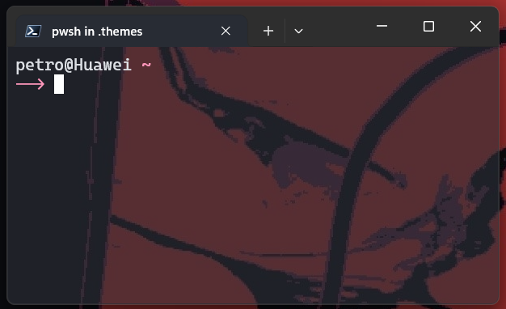

# kvtheme



PowerShell theme for [oh-my-posh](https://ohmyposh.dev/)

## Features

-   <font color="pink">Pink</font>: uses pink color in theme
-   Git: displays git information when shell in a git repository
-   Transient prompt: replaces the prompt with a simpler one to allow more screen real estate
-   Crossplatform: as powershell you can use it on every OS

## Requirements

-   PowerShell
-   Oh-my-posh

Also don't forget about:

-   Nerd fonts

## Installation

Clone repository

```pwsh
git clone https://github.com/Katy248/kvtheme ~/.themes/powershell
```

Initialize theme

```pwsh
oh-my-posh init pwsh --config ~/.themes/powershell/theme.omp.json | Invoke-Expression
```
